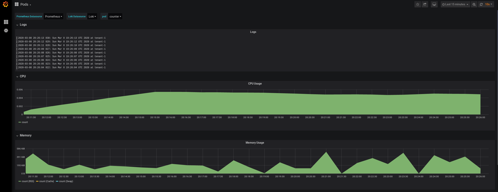
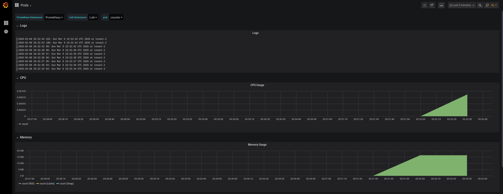

# POC - Logging and Monitoring in a Multitenant Kubernetes Environment

## Scope

- Shared Kubernetes Cluster.
    - Tenant = Namespace.
    - Logging with no host access.

## Out of scope

- Securize access to monitoring (prometheus) and logging (loki) backends
- Isolate workloads (network-policies, sandbox)
- Automatic orchestration of the creation of tenant configuration resources.

## Requirements

- [docker](https://www.docker.com/)
- [kind](https://github.com/kubernetes-sigs/kind) version >= [v0.7.0](https://github.com/kubernetes-sigs/kind/releases/tag/v0.7.0)
- [kubectl](https://kubernetes.io/es/docs/tasks/tools/install-kubectl/#instalar-el-binario-de-kubectl-usando-curl) version >= [1.16.4](https://storage.googleapis.com/kubernetes-release/release/v1.16.4/bin/linux/amd64/kubectl)
- SO dependencies like: git, curl...

## Hands on

### Clone the repo

```bash
$ cd /tmp
$ git clone https://github.com/angelbarrera92/poc-k8s-monitoring-logging-multitenant.git
$ cd poc-k8s-monitoring-logging-multitenant
```

**All this POC will run from this directory: `/tmp/poc-k8s-monitoring-logging-multitenant`**

### Create a Kubernetes Cluster

This POC runs on top of a Kubernetes Cluster *(1.16.4)* created with kind.

```bash
$ kind create cluster  --name poc --config kind-config.yml --image kindest/node:v1.16.4 --wait 1m
$ kind get kubeconfig --name poc > poc.kube.config
$ export KUBECONFIG=$(pwd)/poc.kube.config
$ kubectl get nodes
NAME                STATUS   ROLES    AGE    VERSION
poc-control-plane   Ready    master   111s   v1.16.4
poc-worker          Ready    <none>   68s    v1.16.4
```

### Deploy prometheus *(as as usual)*

The prometheus deployment has to be done in two steps:
First, install Prometheus Operator *(and CRDs)*:

```bash
$ kubectl apply -f prometheus/setup/
```

Check Prometheus Operator is running in the `monitoring` namespace:

```bash
$ kubectl get pods -n monitoring
NAME                                   READY   STATUS    RESTARTS   AGE
prometheus-operator-5d94cdc9bf-j8hxz   1/1     Running   0          3m47s
```

Deploy the traditional monitoring stack:

```bash
$ kubectl apply -f prometheus
```

It deploys:

- kube-state-metrics
- node-exporter
- prometheus
- some useful ServiceMonitors

Check everything is running in the `monitoring` namespace:

```bash
$ kubectl get pods -n monitoring
NAME                                   READY   STATUS    RESTARTS   AGE
kube-state-metrics-5859ffdc64-5vjm6    1/1     Running   0          67s
node-exporter-4ktkf                    2/2     Running   0          67s
node-exporter-7h7js                    2/2     Running   0          67s
prometheus-k8s-0                       3/3     Running   1          68s
prometheus-operator-5d94cdc9bf-j8hxz   1/1     Running   0          5m48s
```

### Deploy Prometheus multi tenant proxy

Deploy the prometheus multi tenant proxy:

```bash
$ kubectl apply -f prometheus-multi-tenant-proxy
```

Check its status:

```bash
$ kubectl get pods -n monitoring -l app=prometheus-multi-tenant-proxy
NAME                                             READY   STATUS    RESTARTS   AGE
prometheus-multi-tenant-proxy-6b6dcf9959-cq748   1/1     Running   0          24s
```

#### Note about prometheus multi tenant proxy

In its default deployment it does not provide any user configuration.

```bash
$ cat prometheus-multi-tenant-proxy/default-configuration-file.yaml
---
apiVersion: v1
kind: Secret
metadata:
  name: prometheus-multi-tenant-proxy-auth-config
  namespace: monitoring
  labels:
    app: prometheus-multi-tenant-proxy
stringData:
  authn.yaml: |-
    users: []
```

Details about the configuration in [its github repository](https://github.com/k8spin/prometheus-multi-tenant-proxy/tree/v1.0.1#configure-the-proxy)

### Deploy grafana *(the easy way)*

Deploy Grafana is super easy:

```bash
$ kubectl apply -f grafana
```

Check Grafana status:

```bash
$ kubectl get pods -n monitoring -l run=grafana
NAME                       READY   STATUS    RESTARTS   AGE
grafana-7546d5cb65-lm45x   1/1     Running   0          3m9s
```

Expose the Grafana service locally:

```bash
$ kubectl port-forward -n monitoring svc/grafana 3000:3000 &
```

Access Grafana `localhost:3000` using `admin:admin`. *(Do not change the password, it is a POC)*

### Deploy grafana multi tenant operator

To deploy the grafana multi tenant operator, first create required CRDs:

```bash
$ kubectl apply -f https://raw.githubusercontent.com/k8spin/grafana-multi-tenant-operator/v1.0.2/deploy/crds.yaml
customresourcedefinition.apiextensions.k8s.io/organizations.grafana.k8spin.cloud created
customresourcedefinition.apiextensions.k8s.io/users.grafana.k8spin.cloud created
```

Then create rbac required stuff:

```bash
$ kubectl apply -f https://raw.githubusercontent.com/k8spin/grafana-multi-tenant-operator/v1.0.2/deploy/service_account.yaml -n monitoring
$ kubectl apply -f https://raw.githubusercontent.com/k8spin/grafana-multi-tenant-operator/v1.0.2/deploy/role.yaml -n monitoring
$ kubectl apply -f https://raw.githubusercontent.com/k8spin/grafana-multi-tenant-operator/v1.0.2/deploy/role_binding.yaml -n monitoring
```

Create grafana multi tenant configuration:

```bash
$ kubectl -n monitoring create secret generic grafana-multi-tenant-operator \
    --from-literal=GRAFANA_MULTI_TENANT_OPERATOR_HOST=grafana.monitoring.svc.cluster.local:3000 \
    --from-literal=GRAFANA_MULTI_TENANT_OPERATOR_ADMIN_USERNAME=admin \
    --from-literal=GRAFANA_MULTI_TENANT_OPERATOR_ADMIN_PASSWORD=admin
```

Finally, deploy the operator:

```bash
$ kubectl apply -f https://raw.githubusercontent.com/k8spin/grafana-multi-tenant-operator/master/deploy/operator.yaml -n monitoring
```

Check grafana multi tenant operator status

```bash
$ kubectl get pods -n monitoring -l application=grafana-multi-tenant-operator
NAME                                            READY   STATUS    RESTARTS   AGE
grafana-multi-tenant-operator-58b9bc849-jldm5   1/1     Running   0          3m47s
```

### Deploy loki and loki multi tenant proxy

First create its own namespace:

```bash
$ kubectl apply -f loki-and-proxy/setup
```

Then, deploy loki and its multi tenant proxy

```bash
$ kubectl apply -f loki-and-proxy
```

Check both pods are running in the `logging` namespace:

```bash
$ kubectl get pods -n logging
NAME                                       READY   STATUS    RESTARTS   AGE
loki-0                                     1/1     Running   0          74s
loki-multi-tenant-proxy-6fc798db74-k2svw   1/1     Running   0          74s
```

#### Note about loki multi tenant proxy

In its default deployment it does not provide any user configuration.

```bash
$ cat loki-and-proxy/default-configuration-file.yaml
---
apiVersion: v1
kind: Secret
metadata:
  name: loki-multi-tenant-proxy-auth-config
  namespace: logging
  labels:
    app: loki-multi-tenant-proxy
stringData:
  authn.yaml: |-
    users: []
```

Details about the configuration in [its github repository](https://github.com/k8spin/loki-multi-tenant-proxy/tree/v1.0.0#configure-the-proxy)

### Check

If you followed every step, you should have the following pods:

```bash
$ kubectl get pods -A
NAMESPACE            NAME                                             READY   STATUS    RESTARTS   AGE
kube-system          coredns-5644d7b6d9-5v8cw                         1/1     Running   0          54m
kube-system          coredns-5644d7b6d9-rjc8l                         1/1     Running   0          54m
kube-system          etcd-poc-control-plane                           1/1     Running   0          53m
kube-system          kindnet-jj6zl                                    1/1     Running   0          54m
kube-system          kindnet-w2xb2                                    1/1     Running   0          54m
kube-system          kube-apiserver-poc-control-plane                 1/1     Running   0          53m
kube-system          kube-controller-manager-poc-control-plane        1/1     Running   0          53m
kube-system          kube-proxy-8f4r4                                 1/1     Running   0          54m
kube-system          kube-proxy-bm9gg                                 1/1     Running   0          54m
kube-system          kube-scheduler-poc-control-plane                 1/1     Running   0          53m
local-path-storage   local-path-provisioner-7745554f7f-wqtcl          1/1     Running   0          54m
logging              loki-0                                           1/1     Running   0          4m22s
logging              loki-multi-tenant-proxy-6fc798db74-k2svw         1/1     Running   0          4m22s
monitoring           grafana-7546d5cb65-lm45x                         1/1     Running   0          37m
monitoring           grafana-multi-tenant-operator-58b9bc849-jldm5    1/1     Running   0          14m
monitoring           kube-state-metrics-5859ffdc64-5vjm6              1/1     Running   0          42m
monitoring           node-exporter-4ktkf                              2/2     Running   0          42m
monitoring           node-exporter-7h7js                              2/2     Running   0          42m
monitoring           prometheus-k8s-0                                 3/3     Running   1          42m
monitoring           prometheus-multi-tenant-proxy-6b6dcf9959-cq748   1/1     Running   0          28m
monitoring           prometheus-operator-5d94cdc9bf-j8hxz             1/1     Running   0          46m
```

And the following services:

```bash
$ kubectl get svc -A
NAMESPACE     NAME                            TYPE        CLUSTER-IP      EXTERNAL-IP   PORT(S)                  AGE
default       kubernetes                      ClusterIP   10.96.0.1       <none>        443/TCP                  56m
kube-system   kube-dns                        ClusterIP   10.96.0.10      <none>        53/UDP,53/TCP,9153/TCP   56m
kube-system   kubelet                         ClusterIP   None            <none>        10250/TCP                47m
logging       loki                            ClusterIP   10.98.126.103   <none>        3100/TCP                 5m45s
logging       loki-headless                   ClusterIP   None            <none>        3100/TCP                 5m45s
logging       loki-multi-tenant-proxy         ClusterIP   10.97.220.198   <none>        3100/TCP                 5m45s
monitoring    grafana                         ClusterIP   10.111.154.10   <none>        3000/TCP                 39m
monitoring    kube-state-metrics              ClusterIP   None            <none>        8080/TCP,8081/TCP        43m
monitoring    node-exporter                   ClusterIP   None            <none>        9100/TCP                 43m
monitoring    prometheus-k8s                  ClusterIP   10.103.74.69    <none>        9090/TCP                 43m
monitoring    prometheus-multi-tenant-proxy   ClusterIP   10.105.61.178   <none>        9091/TCP                 30m
monitoring    prometheus-operated             ClusterIP   None            <none>        9090/TCP                 43m
monitoring    prometheus-operator             ClusterIP   None            <none>        8080/TCP                 48m
```

### Tenant

Every tenant will contain:

- Sample app *(counter)*: Will write to stdout a counter with the current date
- Log Recolector: Based in kail + promtail. This way you do not need access to the host to read logs

Per tenant:

- Create a organization CR (grafana multi tenant operator)
  - With datasources (prometheus through proxy, loki through proxy)
  - With dashboards (sample one, pod metrics information + logs)
- Create a user CR (grafana multi tenant operator)
  - Assign it to its organization
- Modify loki multi tenant proxy configuration file
  - Rollout loki multi tenant proxy
- Modify prometheus multi tenant proxy configuration file
  - Rollout prometheus multi tenant proxy


#### Prepare two tenants 

##### Loki Multi tenant proxy

Let's add two users:

```bash
$ cat loki-authn.yaml 
users:
  - username: Tenant1
    password: 1tnaneT
    orgid: tenant-1
  - username: Tenant2
    password: 2tnaneT
    orgid: tenant-2
$ kubectl create secret generic loki-multi-tenant-proxy-auth-config -n logging --from-file=authn.yaml=loki-authn.yaml --dry-run -o yaml | kubectl apply -f -
$ kubectl rollout restart deploy/loki-multi-tenant-proxy -n logging
```

##### Prometheus Multi tenant proxy

Let's add two users:

```bash
$ cat prometheus-authn.yaml 
users:
  - username: Tenant1
    password: 1tnaneT
    namespace: tenant-1
  - username: Tenant2
    password: 2tnaneT
    namespace: tenant-2
$ kubectl create secret generic prometheus-multi-tenant-proxy-auth-config -n monitoring --from-file=authn.yaml=prometheus-authn.yaml --dry-run -o yaml | kubectl apply -f -
$ kubectl rollout restart deploy/prometheus-multi-tenant-proxy -n monitoring
```

#### Tenant 1

Let's start:

Setup the new tenant (namespace):

```bash
$ kubectl apply -f tenant-1/setup/namespace.yaml
```

Deploy the counter app

```bash
$ kubectl apply -f tenant-1/counter-app.yaml
```

Check the logs:

```bash
$ kubectl logs -f counter -n tenant-1
0: Sun Mar  8 19:09:38 UTC 2020 at tenant-1
1: Sun Mar  8 19:09:40 UTC 2020 at tenant-1
2: Sun Mar  8 19:09:41 UTC 2020 at tenant-1
3: Sun Mar  8 19:09:42 UTC 2020 at tenant-1
4: Sun Mar  8 19:09:43 UTC 2020 at tenant-1
5: Sun Mar  8 19:09:44 UTC 2020 at tenant-1
6: Sun Mar  8 19:09:46 UTC 2020 at tenant-1
7: Sun Mar  8 19:09:47 UTC 2020 at tenant-1
8: Sun Mar  8 19:09:48 UTC 2020 at tenant-1
9: Sun Mar  8 19:09:49 UTC 2020 at tenant-1
10: Sun Mar  8 19:09:51 UTC 2020 at tenant-1
```

Deploy its own log recolector):

```bash
$ kubectl apply -f tenant-1/log-recolector.yaml
```

Check its state:

```bash
$ kubectl get pods -n tenant-1
NAME                              READY   STATUS    RESTARTS   AGE
counter                           1/1     Running   0          11m
log-recolector-76fdc5f465-88nmp   2/2     Running   0          102s
```

Create the organization + datasources + dashboard + user using the CR:

```bash
$ kubectl apply -f tenant-1/grafana-org.yaml
$ kubectl apply -f tenant-1/grafana-user.yaml
```

Check resources:

```bash
$ kubectl get user,org -n monitoring
NAME                                 EMAIL               ORGANIZATIONS
user.grafana.k8spin.cloud/tenant-1   user@tenant-1.com   [tenant-1]

NAME                                         DATASOURCES   DASHBOARDS
organization.grafana.k8spin.cloud/tenant-1   Prometheus    Pods
```

Access grafana: `localhost:3000` with user `tenant-1` and password: `changemeplease` with a browser:



#### Tenant 2

Let's go faster with this one as it is identical to tenant-1:

```
$ kubectl apply -f tenant-2/setup
$ kubectl apply -f tenant-2
```

Access grafana: `localhost:3000` with user `tenant-2` and password: `changemeplease` with a browser:



## Clean up: Delete cluster

```bash
$ kind delete cluster --name poc
Deleting cluster "poc" ...
```
